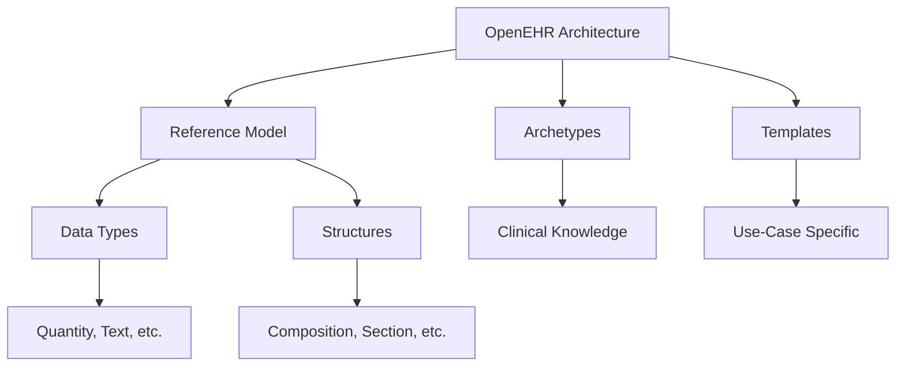
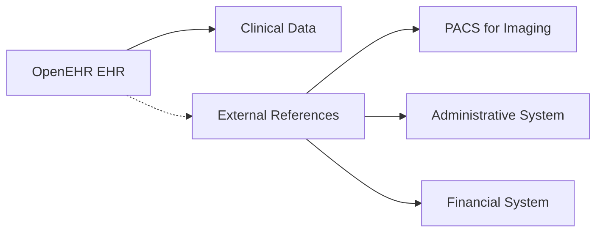
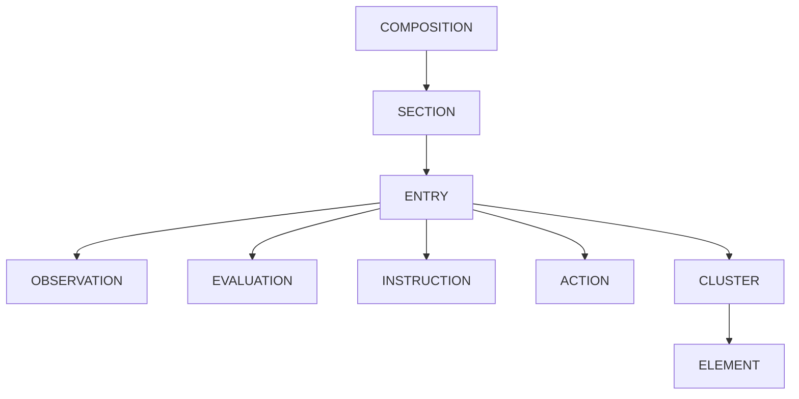
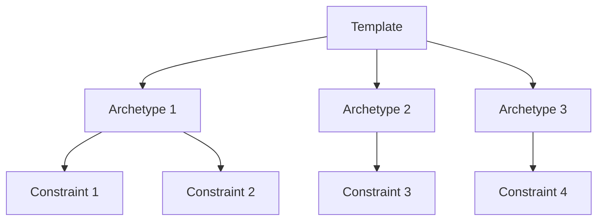
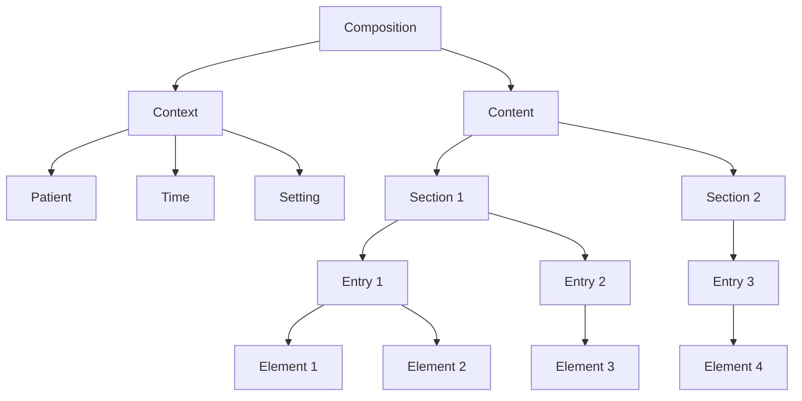
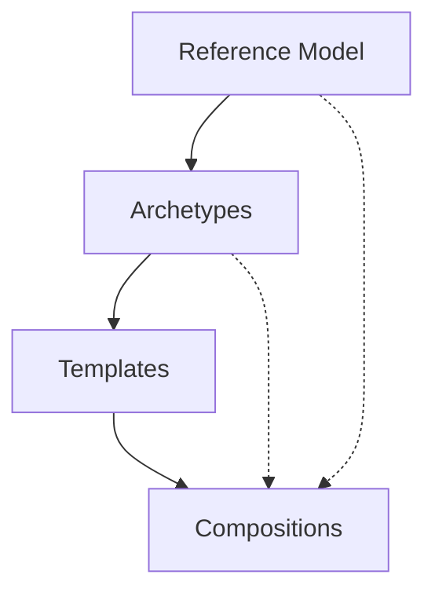
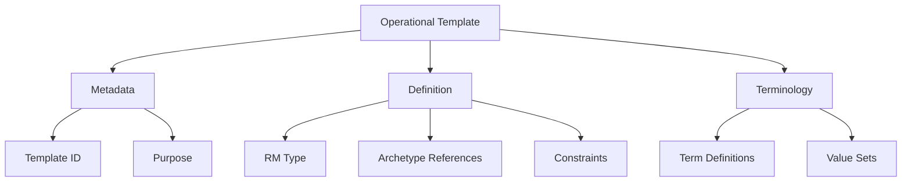

# OpenEHR Intro Session

A comprehensive guide leading our OpenEHR integration efforts


---
layout: two-cols-header
---

# Table of Contents 📚

::left::

01. Introduction to OpenEHR
02. Why OpenEHR?
03. What isn't typically stored in OpenEHR
04. Main vendors/products
05. The Reference Model (RM)
06. Archetypes
07. Templates
08. Compositions

::right::

09. How RM, Archetypes, Templates, and Compositions tie together
10. Operational templates
11. Web templates
12. Flat format vs. non-flat format
13. REST API interaction
14. AQL (Archetype Query Language)
15. Best practices and common pitfalls
16. Hands-on examples

---
layout: intro
---

# Introduction to OpenEHR 🚀

Revolutionizing healthcare data management

---

# What is OpenEHR? 🤔
* An open standard specification for health data storage and exchange
* Developed by the OpenEHR Foundation
* Aims to improve the quality of healthcare through better use of information
* Separates clinical knowledge from technical implementation

<v-click>

## Key Features:

* Two-level modeling approach
* Archetype-based design
* Vendor-neutral
* Supports semantic interoperability

</v-click>

---
layout: two-cols-header
---

# OpenEHR Architecture 🏗️

::left::

* Separates information and knowledge
* Uses archetypes and templates
* Based on a stable reference model

::right::



---
layout: statement
---

# Why OpenEHR? 🎯

Addressing the challenges of modern healthcare IT

---

# Benefits of OpenEHR 👍

<v-clicks>

* **Standardization** of health data across systems and countries
* **Interoperability** between different healthcare IT systems
* **Future-proofing** clinical data
* **Clinician-led** development of data models
* **Flexibility** to adapt to changing medical knowledge
* **Semantic querying** capabilities
* **Reduced vendor lock-in**
* **Improved data quality** and consistency

</v-clicks>

---

# Drawbacks of OpenEHR 👎

<v-clicks>

* **Complexity** of the modeling approach
* **Steep learning curve** for developers
* **Limited tooling** for archetype development
* **Integration challenges** with existing systems
* **Resource-intensive** implementation
* **Model-driven development** may not suit all projects

</v-clicks>

---
layout: two-cols-header
---

# OpenEHR vs Traditional EHR Systems 🥊

::left::

## Traditional EHR

* Fixed data structures
* Limited extensibility
* Vendor-specific implementations
* Difficult to adapt to new requirements

::right::

## OpenEHR

* Flexible, archetype-based models
* Easily extensible
* Vendor-neutral standard
* Adaptable to evolving healthcare needs

---
layout: two-cols-header
---

# What isn't typically stored in OpenEHR 🚫

While OpenEHR is designed to handle a wide range of clinical data, some types of information are usually managed in separate systems:

::left::

<v-clicks>

* **Administrative data**:
  + Billing information
  + Staff schedules
  + Patient appointments
* **Authentication and access control**:
  + User accounts and permissions
* **Raw imaging data**:
  + DICOM files
  + Large medical image datasets

</v-clicks>

::right::

<v-clicks>

* **Large binary files**:
  + Video recordings of procedures
  + Audio files from dictations
  + Scanned documents
* **Non-clinical operational data**:
  + Hospital bed availability
  + Inventory management
  + Equipment maintenance logs

</v-clicks>

---

# Integration with Non-OpenEHR Systems 🤝

While OpenEHR focuses on clinical data, it can reference external resources:



<v-click>

This approach allows for:

* Comprehensive patient records
* Seamless integration with existing hospital systems
* Efficient data management across different domains

</v-click>

---
layout: two-cols-header
---

# Main Vendors/Products 🏪

::left::

## Better

* Offers Better Platform
* Provides tools for building healthcare apps and integrating systems
* [Better Platform](https://www.better.care/platform)

<v-click>

**Note**: We have a central Better instance available for testing purposes.

</v-click>

::right::

## EHRbase

* Open-source OpenEHR clinical data repository
* Implements latest OpenEHR specifications
* [EHRbase GitHub](https://github.com/ehrbase/ehrbase)

<v-click>

**Note**: An EHRbase setup guide is available in our Confluence: [EHRbase Setup Guide](https://jira.cistec.com/confluence/pages/viewpage.action?pageId=176456056)

</v-click>

---
layout: two-cols-header
---

# Comparing Better and EHRbase ⚖️

::left::

## Better

* Commercial product
* Comprehensive suite of tools
* Professional support
* Rapid development capabilities

::right::

## EHRbase

* Open-source
* Community-driven development
* Highly customizable
* Suitable for research and custom implementations
* Vendors such as VitaGroup offer professional services and products based on EHRbase

## <!-- shit documentation -->

## layout: statement

# The Reference Model (RM) 🧱

The foundation of OpenEHR architecture

---

# Understanding the Reference Model 💡
* Defines the logical structures of health records
* Ensures consistency across all OpenEHR systems
* Provides a stable base for building archetypes and templates

<v-click>

## Key components:

* Data structures (e.g., COMPOSITION, SECTION, ENTRY)
* Data types (e.g., DV_TEXT, DV_QUANTITY)
* Support information (e.g., PARTICIPATION, AUDIT_DETAILS)

</v-click>

---
layout: two-cols-header
---

# RM: Data Structures 🏗️

::left::

* COMPOSITION
* SECTION
* ENTRY
  + OBSERVATION
  + EVALUATION
  + INSTRUCTION
  + ACTION
* CLUSTER
* ELEMENT

::right::



---

# RM: Data Types 🧩

OpenEHR RM defines various data types to represent different kinds of clinical information:

<v-clicks>

* **DV_TEXT**: For free text data
* **DV_CODED_TEXT**: For coded terms (e.g., from a terminology)
* **DV_QUANTITY**: For measurements with units
* **DV_COUNT**: For countable items
* **DV_DATETIME**: For date and time values
* **DV_BOOLEAN**: For true/false values
* **DV_IDENTIFIER**: For identifiers (e.g., social security numbers)
* **DV_MULTIMEDIA**: For images, audio, or other media
* **DV_PARSABLE**: For parsable content (e.g., mathematical expressions)

</v-clicks>

---

# Example: Blood Pressure in RM 🩺

<ScrollableCode>

```json
{
  "_type": "OBSERVATION",
  "data": {
    "_type": "HISTORY",
    "events": [
      {
        "_type": "POINT_EVENT",
        "data": {
          "_type": "ITEM_LIST",
          "items": [
            {
              "_type": "ELEMENT",
              "name": { "_type": "DV_TEXT", "value": "Systolic" },
              "value": {
                "_type": "DV_QUANTITY",
                "magnitude": 120,
                "units": "mm[Hg]"
              }
            },
            {
              "_type": "ELEMENT",
              "name": { "_type": "DV_TEXT", "value": "Diastolic" },
              "value": {
                "_type": "DV_QUANTITY",
                "magnitude": 80,
                "units": "mm[Hg]"
              }
            }
          ]
        }
      }
    ]
  }
}
```

</ScrollableCode>

---
layout: statement
---

# Archetypes 🧬

Reusable clinical concept definitions

---

# Understanding Archetypes 🔍
* Formal definitions of clinical concepts
* Written in Archetype Definition Language (ADL)
* Constraint-based approach to defining clinical content
* Developed and reviewed by domain experts

<v-click>

## Examples of Archetypes:

* Blood Pressure
* Body Temperature
* Medication Order
* Laboratory Result

</v-click>

---

# Anatomy of an Archetype 🔬

<ScrollableCode>

```json
archetype (adl_version=1.4; uid=1013a2b4-b7d2-4594-90d6-e1992e9aae3d)
	openEHR-EHR-OBSERVATION.blood_pressure.v2
concept
	[at0000]	-- Blood pressure measurement
language
	original_language = <[ISO_639-1::en]>
description
	original_author = <
		["name"] = <"Sam Heard">
		["organisation"] = <"Ocean Informatics">
		["email"] = <"sam.heard@oceaninformatics.com">
		["date"] = <"2006-03-26">
	>
	details = <
		["en"] = <
			language = <[ISO_639-1::en]>
			purpose = <"To record the systemic arterial blood pressure of an individual.">
			use = <"Use to record all representations of systemic arterial blood pressure measurement,
            including current or historical blood pressure readings or measurements.">
			keywords = <"systolic", "diastolic", "blood pressure", "mean arterial pressure">
			misuse = <"Not to be used to record measurements of intra-arterial pressure.
            Use OBSERVATION.intravascular_pressure for this purpose.">
			copyright = <"© openEHR Foundation">
		>
	>
definition
	OBSERVATION[at0000] matches {	-- Blood pressure measurement
		data matches {
			HISTORY[at0001] matches {	-- History
				events cardinality matches {1..*; unordered} matches {
					EVENT[at0006] occurrences matches {0..*} matches {	-- Any event
						data matches {
							ITEM_TREE[at0003] matches {	-- Tree
								items cardinality matches {0..*; unordered} matches {
									ELEMENT[at0004] occurrences matches {0..1} matches {	-- Systolic
										value matches {
											DV_QUANTITY matches {
												property = <[openehr::125]>
												list = <
													["1"] = <
														units = <"mm[Hg]">
														magnitude = <|0.0..1000.0|>
														precision = <|0|>
													>
												>
											}
										}
									}
									ELEMENT[at0005] occurrences matches {0..1} matches {	-- Diastolic
										value matches {
											DV_QUANTITY matches {
												property = <[openehr::125]>
												list = <
													["1"] = <
														units = <"mm[Hg]">
														magnitude = <|0.0..1000.0|>
														precision = <|0|>
													>
												>
											}
										}
									}
								}
							}
						}
					}
				}
			}
		}
	}
ontology
	term_definitions = <
		["en"] = <
			items = <
				["at0000"] = <
					text = <"Blood pressure measurement">
					description = <"The local measurement of arterial blood pressure which is a surrogate for arterial pressure in the systemic circulation.">
				>
				["at0001"] = <
					text = <"History">
					description = <"@ internal @">
				>
				["at0003"] = <
					text = <"Tree">
					description = <"@ internal @">
				>
				["at0004"] = <
					text = <"Systolic">
					description = <"The systolic blood pressure measurement.">
				>
				["at0005"] = <
					text = <"Diastolic">
					description = <"The diastolic blood pressure measurement.">
				>
				["at0006"] = <
					text = <"Any event">
					description = <"Default, unspecified point in time or interval event which may be explicitly defined in a template or at run-time.">
				>
			>
		>
	>
```

</ScrollableCode>

---

# Key Components of an Archetype 🗝️

<v-clicks>

01. **Header**: Contains metadata about the archetype (version, ID, etc.)
02. **Concept**: Defines the clinical concept represented by the archetype
03. **Language**: Specifies the original language and translations
04. **Description**: Provides detailed information about the archetype's purpose, use, and authorship
05. **Definition**: Describes the structure and constraints of the archetype
06. **Ontology**: Contains term definitions and bindings to external terminologies

</v-clicks>

---

# Archetype Modeling Tools 🛠️

There are several tools available for creating and managing archetypes:

* **Archetype Editor**: A standalone Java application for creating and editing archetypes - [Download Archetype Editor](https://www.openehr.org/downloads/archetypeeditor/home)

* **Template Designer**: For creating templates based on archetype - [Ocean Template Designer](https://oceanhealthsystems.com/software/archetype-editor)

* **Clinical Knowledge Manager (CKM)**: A web-based platform for collaborative archetype development and management - [openEHR CKM](https://ckm.openehr.org/ckm/) / [Apperta CKM](https://ckm.apperta.org/ckm/)

* **Archetype Designer**: A web-based tool for creating and editing archetypes and templates - [Better Archetype Designer](https://tools.better.care/archetype-designer/)

* **ADL Designer**: Another web-based tool for creating and editing archetypes and templates - [ADL Designer](https://tools.openehr.org/designer/)

---
layout: statement
---

# Templates 📄

Combining archetypes for specific use cases

---

# Understanding Templates 🧠
* Combine and constrain archetypes for specific use cases
* Define the structure of data entry forms or documents
* Allow for local customization while maintaining interoperability

<v-click>

## Examples of Templates:

* Diabetes Consultation
* Medical Score such as APGAR
* Vital Signs Chart
* Medication Reconciliation Form

</v-click>

---

# Template Structure 🏗️



---

# Template Example: Vital Signs 📊

<ScrollableCode>

```xml
<template xmlns="http://schemas.openehr.org/v1">
  <language>
    <terminology_id>
      <value>ISO_639-1</value>
    </terminology_id>
    <code_string>en</code_string>
  </language>
  <description>
    <original_author id="Original Author">Not Specified</original_author>
    <lifecycle_state>Initial</lifecycle_state>
    <details>
      <purpose>To record vital signs measurements</purpose>
      <use>Use to create a vital signs chart</use>
      <misuse>Not to be used for specialized measurements</misuse>
    </details>
    <other_details id="MetaDataSet:Sample Set ">Template metadata sample set </other_details>
  </description>
  <definition>
    <rm_type_name>COMPOSITION</rm_type_name>
    <occurrences>
      <lower_included>true</lower_included>
      <upper_included>true</upper_included>
      <lower_unbounded>false</lower_unbounded>
      <upper_unbounded>false</upper_unbounded>
      <lower>1</lower>
      <upper>1</upper>
    </occurrences>
    <node_id>at0000</node_id>
    <attributes xsi:type="C_SINGLE_ATTRIBUTE">
      <rm_attribute_name>category</rm_attribute_name>
      <existence>
        <lower_included>true</lower_included>
        <upper_included>true</upper_included>
        <lower_unbounded>false</lower_unbounded>
        <upper_unbounded>false</upper_unbounded>
        <lower>1</lower>
        <upper>1</upper>
      </existence>
      <children xsi:type="C_COMPLEX_OBJECT">
        <rm_type_name>DV_CODED_TEXT</rm_type_name>
        <occurrences>
          <lower_included>true</lower_included>
          <upper_included>true</upper_included>
          <lower_unbounded>false</lower_unbounded>
          <upper_unbounded>false</upper_unbounded>
          <lower>1</lower>
          <upper>1</upper>
        </occurrences>
        <node_id />
        <attributes xsi:type="C_SINGLE_ATTRIBUTE">
          <rm_attribute_name>defining_code</rm_attribute_name>
          <existence>
            <lower_included>true</lower_included>
            <upper_included>true</upper_included>
            <lower_unbounded>false</lower_unbounded>
            <upper_unbounded>false</upper_unbounded>
            <lower>1</lower>
            <upper>1</upper>
          </existence>
          <children xsi:type="C_COMPLEX_OBJECT">
            <rm_type_name>CODE_PHRASE</rm_type_name>
            <occurrences>
              <lower_included>true</lower_included>
              <upper_included>true</upper_included>
              <lower_unbounded>false</lower_unbounded>
              <upper_unbounded>false</upper_unbounded>
              <lower>1</lower>
              <upper>1</upper>
            </occurrences>
            <node_id />
            <attributes xsi:type="C_SINGLE_ATTRIBUTE">
              <rm_attribute_name>code_string</rm_attribute_name>
              <existence>
                <lower_included>true</lower_included>
                <upper_included>true</upper_included>
                <lower_unbounded>false</lower_unbounded>
                <upper_unbounded>false</upper_unbounded>
                <lower>1</lower>
                <upper>1</upper>
              </existence>
              <children xsi:type="C_PRIMITIVE_OBJECT">
                <rm_type_name>STRING</rm_type_name>
                <occurrences>
                  <lower_included>true</lower_included>
                  <upper_included>true</upper_included>
                  <lower_unbounded>false</lower_unbounded>
                  <upper_unbounded>false</upper_unbounded>
                  <lower>1</lower>
                  <upper>1</upper>
                </occurrences>
                <node_id />
                <item xsi:type="C_STRING">
                  <list>433</list>
                </item>
              </children>
            </attributes>
          </children>
        </attributes>
      </children>
    </attributes>
    <attributes xsi:type="C_MULTIPLE_ATTRIBUTE">
      <rm_attribute_name>content</rm_attribute_name>
      <existence>
        <lower_included>true</lower_included>
        <upper_included>true</upper_included>
        <lower_unbounded>false</lower_unbounded>
        <upper_unbounded>false</upper_unbounded>
        <lower>0</lower>
        <upper>1</upper>
      </existence>
      <children xsi:type="C_ARCHETYPE_ROOT">
        <rm_type_name>OBSERVATION</rm_type_name>
        <occurrences>
          <lower_included>true</lower_included>
          <upper_included>true</upper_included>
          <lower_unbounded>false</lower_unbounded>
          <upper_unbounded>false</upper_unbounded>
          <lower>0</lower>
          <upper>1</upper>
        </occurrences>
        <node_id>at0000</node_id>
        <attributes xsi:type="C_SINGLE_ATTRIBUTE">
          <rm_attribute_name>data</rm_attribute_name>
          <existence>
            <lower_included>true</lower_included>
            <upper_included>true</upper_included>
            <lower_unbounded>false</lower_unbounded>
            <upper_unbounded>false</upper_unbounded>
            <lower>1</lower>
            <upper>1</upper>
          </existence>
          <children xsi:type="C_COMPLEX_OBJECT">
            <rm_type_name>HISTORY</rm_type_name>
            <occurrences>
              <lower_included>true</lower_included>
              <upper_included>true</upper_included>
              <lower_unbounded>false</lower_unbounded>
              <upper_unbounded>false</upper_unbounded>
              <lower>1</lower>
              <upper>1</upper>
            </occurrences>
            <node_id>at0001</node_id>
            <attributes xsi:type="C_MULTIPLE_ATTRIBUTE">
              <rm_attribute_name>events</rm_attribute_name>
              <existence>
                <lower_included>true</lower_included>
                <upper_included>true</upper_included>
                <lower_unbounded>false</lower_unbounded>
                <upper_unbounded>false</upper_unbounded>
                <lower>0</lower>
                <upper>1</upper>
              </existence>
              <children xsi:type="C_COMPLEX_OBJECT">
                <rm_type_name>EVENT</rm_type_name>
                <occurrences>
                  <lower_included>true</lower_included>
                  <upper_included>true</upper_included>
                  <lower_unbounded>false</lower_unbounded>
                  <upper_unbounded>false</upper_unbounded>
                  <lower>0</lower>
                  <upper>1</upper>
                </occurrences>
                <node_id>at0002</node_id>
                <attributes xsi:type="C_SINGLE_ATTRIBUTE">
                  <rm_attribute_name>data</rm_attribute_name>
                  <existence>
                    <lower_included>true</lower_included>
                    <upper_included>true</upper_included>
                    <lower_unbounded>false</lower_unbounded>
                    <upper_unbounded>false</upper_unbounded>
                    <lower>1</lower>
                    <upper>1</upper>
                  </existence>
                  <children xsi:type="C_COMPLEX_OBJECT">
                    <rm_type_name>ITEM_TREE</rm_type_name>
                    <occurrences>
                      <lower_included>true</lower_included>
                      <upper_included>true</upper_included>
                      <lower_unbounded>false</lower_unbounded>
                      <upper_unbounded>false</upper_unbounded>
                      <lower>1</lower>
                      <upper>1</upper>
                    </occurrences>
                    <node_id>at0003</node_id>
                    <attributes xsi:type="C_MULTIPLE_ATTRIBUTE">
                      <rm_attribute_name>items</rm_attribute_name>
                      <existence>
                        <lower_included>true</lower_included>
                        <upper_included>true</upper_included>
                        <lower_unbounded>false</lower_unbounded>
                        <upper_unbounded>false</upper_unbounded>
                        <lower>0</lower>
                        <upper>1</upper>
                      </existence>
                      <children xsi:type="C_COMPLEX_OBJECT">
                        <rm_type_name>ELEMENT</rm_type_name>
                        <occurrences>
                          <lower_included>true</lower_included>
                          <upper_included>true</upper_included>
                          <lower_unbounded>false</lower_unbounded>
                          <upper_unbounded>false</upper_unbounded>
                          <lower>0</lower>
                          <upper>1</upper>
                        </occurrences>
                        <node_id>at0004</node_id>
                        <attributes xsi:type="C_SINGLE_ATTRIBUTE">
                          <rm_attribute_name>value</rm_attribute_name>
                          <existence>
                            <lower_included>true</lower_included>
                            <upper_included>true</upper_included>
                            <lower_unbounded>false</lower_unbounded>
                            <upper_unbounded>false</upper_unbounded>
                            <lower>0</lower>
                            <upper>1</upper>
                          </existence>
                          <children xsi:type="C_COMPLEX_OBJECT">
                            <rm_type_name>DV_QUANTITY</rm_type_name>
                            <occurrences>
                              <lower_included>true</lower_included>
                              <upper_included>true</upper_included>
                              <lower_unbounded>false</lower_unbounded>
                              <upper_unbounded>false</upper_unbounded>
                              <lower>1</lower>
                              <upper>1</upper>
                            </occurrences>
                            <node_id />
                            <attributes xsi:type="C_SINGLE_ATTRIBUTE">
                              <rm_attribute_name>magnitude</rm_attribute_name>
                              <existence>
                                <lower_included>true</lower_included>
                                <upper_included>true</upper_included>
                                <lower_unbounded>false</lower_unbounded>
                                <upper_unbounded>false</upper_unbounded>
                                <lower>1</lower>
                                <upper>1</upper>
                              </existence>
                              <children xsi:type="C_PRIMITIVE_OBJECT">
                                <rm_type_name>REAL</rm_type_name>
                                <occurrences>
                                  <lower_included>true</lower_included>
                                  <upper_included>true</upper_included>
                                  <lower_unbounded>false</lower_unbounded>
                                  <upper_unbounded>false</upper_unbounded>
                                  <lower>1</lower>
                                  <upper>1</upper>
                                </occurrences>
                                <node_id />
                                <item xsi:type="C_REAL">
                                  <range>
                                    <lower_included>true</lower_included>
                                    <upper_included>true</upper_included>
                                    <lower_unbounded>false</lower_unbounded>
                                    <upper_unbounded>false</upper_unbounded>
                                    <lower>0</lower>
                                    <upper>1000</upper>
                                  </range>
                                </item>
                              </children>
                            </attributes>
                            <attributes xsi:type="C_SINGLE_ATTRIBUTE">
                              <rm_attribute_name>units</rm_attribute_name>
                              <existence>
                                <lower_included>true</lower_included>
                                <upper_included>true</upper_included>
                                <lower_unbounded>false</lower_unbounded>
                                <upper_unbounded>false</upper_unbounded>
                                <lower>1</lower>
                                <upper>1</upper>
                              </existence>
                              <children xsi:type="C_PRIMITIVE_OBJECT">
                                <rm_type_name>STRING</rm_type_name>
                                <occurrences>
                                  <lower_included>true</lower_included>
                                  <upper_included>true</upper_included>
                                  <lower_unbounded>false</lower_unbounded>
                                  <upper_unbounded>false</upper_unbounded>
                                  <lower>1</lower>
                                  <upper>1</upper>
                                </occurrences>
                                <node_id />
                                <item xsi:type="C_STRING">
                                  <list>mm[Hg]</list>
                                </item>
                              </children>
                            </attributes>
                          </children>
                        </attributes>
                      </children>
                    </attributes>
                  </children>
                </attributes>
              </children>
            </attributes>
          </children>
        </attributes>
      </children>
    </attributes>
  </definition>
</template>
```

</ScrollableCode>

---
layout: two-cols-header
---

# Template Benefits

::left::

* Customization for specific use cases
* Improved data entry efficiency
* Consistent data capture across an organization
* Easier integration with existing workflows

::right::

<v-click>

## Challenges:

* Balancing flexibility and standardization
* Managing template versions
* Ensuring alignment with underlying archetypes

</v-click>

---
layout: statement
---

# Compositions

The clinical documents of OpenEHR

---

# Understanding Compositions
* Top-level structures in OpenEHR
* Represent a clinical document or encounter
* Contain data structured according to templates
* Versioned and audited

<v-click>

## Examples of Compositions:

* Patient Visit Record
* Discharge Summary
* Radiology Report
* Medication Prescription

</v-click>

---

# Composition Structure



---

# Composition Example: Patient Visit

<ScrollableCode>

```json
{
  "_type": "COMPOSITION",
  "name": {
    "_type": "DV_TEXT",
    "value": "Patient Visit"
  },
  "archetype_details": {
    "_type": "ARCHETYPED",
    "archetype_id": {
      "value": "openEHR-EHR-COMPOSITION.encounter.v1"
    },
    "template_id": {
      "value": "Patient Visit Template"
    }
  },
  "language": {
    "_type": "CODE_PHRASE",
    "terminology_id": {
      "_type": "TERMINOLOGY_ID",
      "value": "ISO_639-1"
    },
    "code_string": "en"
  },
  "territory": {
    "_type": "CODE_PHRASE",
    "terminology_id": {
      "_type": "TERMINOLOGY_ID",
      "value": "ISO_3166-1"
    },
    "code_string": "US"
  },
  "category": {
    "_type": "DV_CODED_TEXT",
    "value": "event",
    "defining_code": {
      "_type": "CODE_PHRASE",
      "terminology_id": {
        "_type": "TERMINOLOGY_ID",
        "value": "openehr"
      },
      "code_string": "433"
    }
  },
  "composer": {
    "_type": "PARTY_IDENTIFIED",
    "name": "Dr. Jane Smith"
  },
  "context": {
    "_type": "EVENT_CONTEXT",
    "start_time": {
      "_type": "DV_DATE_TIME",
      "value": "2023-07-01T10:30:00Z"
    },
    "setting": {
      "_type": "DV_CODED_TEXT",
      "value": "outpatient clinic",
      "defining_code": {
        "_type": "CODE_PHRASE",
        "terminology_id": {
          "_type": "TERMINOLOGY_ID",
          "value": "openehr"
        },
        "code_string": "238"
      }
    }
  },
  "content": [
    {
      "_type": "OBSERVATION",
      "name": {
        "_type": "DV_TEXT",
        "value": "Blood Pressure"
      },
      "archetype_details": {
        "_type": "ARCHETYPED",
        "archetype_id": {
          "value": "openEHR-EHR-OBSERVATION.blood_pressure.v2"
        }
      },
      "data": {
        "_type": "HISTORY",
        "origin": {
          "_type": "DV_DATE_TIME",
          "value": "2023-07-01T10:35:00Z"
        },
        "events": [
          {
            "_type": "POINT_EVENT",
            "time": {
              "_type": "DV_DATE_TIME",
              "value": "2023-07-01T10:35:00Z"
            },
            "data": {
              "_type": "ITEM_TREE",
              "items": [
                {
                  "_type": "ELEMENT",
                  "name": {
                    "_type": "DV_TEXT",
                    "value": "Systolic"
                  },
                  "value": {
                    "_type": "DV_QUANTITY",
                    "magnitude": 120,
                    "units": "mm[Hg]"
                  }
                },
                {
                  "_type": "ELEMENT",
                  "name": {
                    "_type": "DV_TEXT",
                    "value": "Diastolic"
                  },
                  "value": {
                    "_type": "DV_QUANTITY",
                    "magnitude": 80,
                    "units": "mm[Hg]"
                  }
                }
              ]
            }
          }
        ]
      }
    }
  ]
}
```

</ScrollableCode>

---

# Key Aspects of Compositions

<v-clicks>

01. **Metadata**: Information about the composition itself (e.g., archetype used, language, territory)
02. **Context**: Details about when and where the clinical event occurred
03. **Content**: The actual clinical data, structured according to archetypes and templates
04. **Versioning**: Each change creates a new version, maintaining a complete history
05. **Flexibility**: Can contain various types of entries (OBSERVATION, EVALUATION, INSTRUCTION, ACTION)
06. **Integrity**: Signed and sealed to ensure data integrity and non-repudiation

</v-clicks>

---
layout: statement
---

# Putting It All Together

The Building Blocks of OpenEHR

---
layout: two-cols-header
---

# OpenEHR Architecture Overview

::left::



::right::

<v-click>

* **Reference Model**: Provides the foundational data types and structures
* **Archetypes**: Define reusable clinical concepts based on the RM
* **Templates**: Combine and constrain archetypes for specific use cases
* **Compositions**: Use templates to structure actual patient data

</v-click>

---
layout: two-cols-header
---

# Interplay Between Components

::left::

## Design-Time

01. Reference Model is designed (not by us)
02. Archetypes are created based on RM (by domain experts, partially by us)
03. Templates are designed using archetypes (by us)

::right::

## Runtime

01. Templates guide data entry
02. Data is validated against archetypes
03. Compositions are created and stored
04. Data conforms to Reference Model
---

# Benefits of This Architecture

<v-clicks>

* **Separation of Concerns**: Clinical knowledge (archetypes) is separate from software implementation (RM)
* **Flexibility**: New clinical concepts can be added without changing the underlying software
* **Interoperability**: Standard RM and archetypes ensure data can be shared and understood across systems
* **Future-proofing**: Data remains valid even as clinical knowledge evolves
* **Querying**: Standardized structures allow for powerful querying capabilities

</v-clicks>

---
layout: statement
---

# Operational Templates

Bridging Design and Runtime, but not really for us

---

# Understanding Operational Templates
* Computable form of OpenEHR templates
* Used by EHR systems to validate and process data
* Generated from design-time templates
* Contain all necessary information for runtime operations

<v-click>

## Key Characteristics:

* Fully expanded structure
* All constraints resolved
* Ready for direct use by software

</v-click>

---

# Operational Template Structure



---

# Example: Operational Template Snippet

<ScrollableCode>

```xml
<template xmlns:xsi="http://www.w3.org/2001/XMLSchema-instance" xmlns:xsd="http://www.w3.org/2001/XMLSchema" xmlns="http://schemas.openehr.org/v1">
  <language>
    <terminology_id>
      <value>ISO_639-1</value>
    </terminology_id>
    <code_string>en</code_string>
  </language>
  <description>
    <original_author id="Original Author">Not Specified</original_author>
    <lifecycle_state>Initial</lifecycle_state>
    <details>
      <purpose>To record vital signs measurements</purpose>
      <use>Use to create a vital signs chart</use>
      <misuse>Not to be used for specialized measurements</misuse>
    </details>
    <other_details id="MetaDataSet:Sample Set ">Template metadata sample set </other_details>
  </description>
  <definition>
    <rm_type_name>COMPOSITION</rm_type_name>
    <occurrences>
      <lower_included>true</lower_included>
      <upper_included>true</upper_included>
      <lower_unbounded>false</lower_unbounded>
      <upper_unbounded>false</upper_unbounded>
      <lower>1</lower>
      <upper>1</upper>
    </occurrences>
    <node_id>at0000</node_id>
    <attributes xsi:type="C_SINGLE_ATTRIBUTE">
      <rm_attribute_name>category</rm_attribute_name>
      <existence>
        <lower_included>true</lower_included>
        <upper_included>true</upper_included>
        <lower_unbounded>false</lower_unbounded>
        <upper_unbounded>false</upper_unbounded>
        <lower>1</lower>
        <upper>1</upper>
      </existence>
      <children xsi:type="C_COMPLEX_OBJECT">
        <rm_type_name>DV_CODED_TEXT</rm_type_name>
        <occurrences>
          <lower_included>true</lower_included>
          <upper_included>true</upper_included>
          <lower_unbounded>false</lower_unbounded>
          <upper_unbounded>false</upper_unbounded>
          <lower>1</lower>
          <upper>1</upper>
        </occurrences>
        <node_id />
        <attributes xsi:type="C_SINGLE_ATTRIBUTE">
          <rm_attribute_name>defining_code</rm_attribute_name>
          <existence>
            <lower_included>true</lower_included>
            <upper_included>true</upper_included>
            <lower_unbounded>false</lower_unbounded>
            <upper_unbounded>false</upper_unbounded>
            <lower>1</lower>
            <upper>1</upper>
          </existence>
          <children xsi:type="C_COMPLEX_OBJECT">
            <rm_type_name>CODE_PHRASE</rm_type_name>
            <occurrences>
              <lower_included>true</lower_included>
              <upper_included>true</upper_included>
              <lower_unbounded>false</lower_unbounded>
              <upper_unbounded>false</upper_unbounded>
              <lower>1</lower>
              <upper>1</upper>
            </occurrences>
            <node_id />
            <attributes xsi:type="C_SINGLE_ATTRIBUTE">
              <rm_attribute_name>code_string</rm_attribute_name>
              <existence>
                <lower_included>true</lower_included>
                <upper_included>true</upper_included>
                <lower_unbounded>false</lower_unbounded>
                <upper_unbounded>false</upper_unbounded>
                <lower>1</lower>
                <upper>1</upper>
              </existence>
              <children xsi:type="C_PRIMITIVE_OBJECT">
                <rm_type_name>STRING</rm_type_name>
                <occurrences>
                  <lower_included>true</lower_included>
                  <upper_included>true</upper_included>
                  <lower_unbounded>false</lower_unbounded>
                  <upper_unbounded>false</upper_unbounded>
                  <lower>1</lower>
                  <upper>1</upper>
                </occurrences>
                <node_id />
                <item xsi:type="C_STRING">
                  <list>433</list>
                </item>
              </children>
            </attributes>
          </children>
        </attributes>
      </children>
    </attributes>
    <!-- More attributes and nested structures... -->
  </definition>
  <!-- Terminology section... -->
</template>
```

</ScrollableCode>

---

# Operational Templates in Practice

<v-clicks>

* Used by EHR systems to:
  + Generate user interfaces
  + Validate incoming data
  + Guide data storage and retrieval
* Enable consistent implementation across different systems
* Facilitate semantic interoperability
* Support versioning of templates

</v-clicks>

---
layout: statement
---

# Web Templates

Simplifying OpenEHR for Web Development

---

# Understanding Web Templates
* JSON representation of Operational Templates
* Designed for easy consumption by web applications
* Simplify frontend development for OpenEHR-based systems

<v-click>

## Key Benefits:

* Easier to parse and use in JavaScript
* More compact than full XML Operational Templates
* Can be directly used to generate dynamic forms
* **Note: This is the work currently being undertaken in the K6 Scores project.**

</v-click>

---

# Example Web Template Structure

<ScrollableCode>

```json
{
  "templateId": "Vital Signs",
  "version": "1.0.0",
  "defaultLanguage": "en",
  "languages": ["en"],
  "tree": {
    "id": "vital_signs",
    "name": "Vital Signs",
    "localizedName": "Vital Signs",
    "rmType": "COMPOSITION",
    "nodeId": "openEHR-EHR-COMPOSITION.encounter.v1",
    "min": 1,
    "max": 1,
    "localizedNames": {
      "en": "Vital Signs"
    },
    "localizedDescriptions": {
      "en": "Record of vital signs measurements"
    },
    "children": [
      {
        "id": "blood_pressure",
        "name": "Blood Pressure",
        "localizedName": "Blood Pressure",
        "rmType": "OBSERVATION",
        "nodeId": "openEHR-EHR-OBSERVATION.blood_pressure.v2",
        "min": 0,
        "max": 1,
        "localizedNames": {
          "en": "Blood Pressure"
        },
        "localizedDescriptions": {
          "en": "Measurement of blood pressure"
        },
        "children": [
          {
            "id": "systolic",
            "name": "Systolic",
            "localizedName": "Systolic",
            "rmType": "DV_QUANTITY",
            "min": 1,
            "max": 1,
            "localizedNames": {
              "en": "Systolic"
            },
            "localizedDescriptions": {
              "en": "Peak systemic arterial blood pressure"
            },
            "annotations": {
              "unit": "mm[Hg]",
              "precision": 0
            }
          },
          {
            "id": "diastolic",
            "name": "Diastolic",
            "localizedName": "Diastolic",
            "rmType": "DV_QUANTITY",
            "min": 1,
            "max": 1,
            "localizedNames": {
              "en": "Diastolic"
            },
            "localizedDescriptions": {
              "en": "Minimum systemic arterial blood pressure"
            },
            "annotations": {
              "unit": "mm[Hg]",
              "precision": 0
            }
          }
        ]
      }
    ]
  }
}
```

</ScrollableCode>

---

# Using Web Templates in Frontend Development

<ScrollableCode>

```javascript
import React from 'react';
const generateForm = (webTemplate) => {
  const renderField = (field) => {
    switch (field.rmType) {
      case 'DV_QUANTITY':
        return (
          <div key={field.id}>
            <label htmlFor={field.id}>{field.localizedName}</label>
            <input
              type="number"
              id={field.id}
              name={field.id}
              step={1 / Math.pow(10, field.annotations.precision)}
            />
            <span>{field.annotations.unit}</span>
          </div>
        );
      case 'DV_TEXT':
        return (
          <div key={field.id}>
            <label htmlFor={field.id}>{field.localizedName}</label>
            <input type="text" id={field.id} name={field.id} />
          </div>
        );
      // Add more cases for other rmTypes
      default:
        return null;
    }
  };

  const renderChildren = (children) => {
    return children.map(child => {
      if (child.children) {
        return (
          <fieldset key={child.id}>
            <legend>{child.localizedName}</legend>
            {renderChildren(child.children)}
          </fieldset>
        );
      }
      return renderField(child);
    });
  };

  return (
    <form>
      <h2>{webTemplate.tree.localizedName}</h2>
      {renderChildren(webTemplate.tree.children)}
      <button type="submit">Submit</button>
    </form>
  );
};

const VitalSignsForm = ({ webTemplate }) => {
  return generateForm(webTemplate);
};

export default VitalSignsForm;
```

</ScrollableCode>

---

# Benefits of Web Templates for Web Application Development 🌐

<v-clicks>

01. **Dynamic Form Generation**: "Easily" create forms based on the template structure
02. **Localization Support**: Use `localizedName` and `localizedDescriptions` for multi-language support
03. **Validation**: Implement client and server-side validation based on `min`, `max`, and other constraints
04. **Flexibility**: Adapt to changes in templates without modifying frontend code
05. **Consistency**: Ensure UI aligns with the underlying OpenEHR data model
06. **Reduced Development Time**: Automate repetitive aspects of UI creation

</v-clicks>

<!-- "Easily" - requires certain standards and consistency during the design phase of the templates -->

---
layout: statement
---

# Flat Format 🥞 vs. Non-Flat Format 🌳

Balancing Simplicity and Richness in OpenEHR Data

---
layout: two-cols-header
---

# Understanding Flat vs. Non-Flat Formats

::left::

## Flat Format

* Simplified, denormalized representation
* Key-value pairs
* Easier for data entry and querying
* Loses some context and relationships

::right::

## Non-Flat Format

* Full, hierarchical OpenEHR structure
* Preserves all context and relationships
* More complex to work with
* Retains all metadata and semantic meaning

---

# Example: Flat vs. Non-Flat Format

```json
{
  "vital_signs/blood_pressure/systolic|magnitude": 120,
  "vital_signs/blood_pressure/systolic|unit": "mm[Hg]",
  "vital_signs/blood_pressure/diastolic|magnitude": 80,
  "vital_signs/blood_pressure/diastolic|unit": "mm[Hg]",
  "vital_signs/pulse_rate|magnitude": 72,
  "vital_signs/pulse_rate|unit": "/min"
}

```

<ScrollableCode style="height: 250px">

```json
{
  "vital_signs": {
    "_type": "COMPOSITION",
    "name": {
      "_type": "DV_TEXT",
      "value": "Vital Signs"
    },
    "content": [
      {
        "_type": "OBSERVATION",
        "name": {
          "_type": "DV_TEXT",
          "value": "Blood Pressure"
        },
        "data": {
          "_type": "HISTORY",
          "events": [
            {
              "_type": "POINT_EVENT",
              "data": {
                "_type": "ITEM_TREE",
                "items": [
                  {
                    "_type": "ELEMENT",
                    "name": {
                      "_type": "DV_TEXT",
                      "value": "Systolic"
                    },
                    "value": {
                      "_type": "DV_QUANTITY",
                      "magnitude": 120,
                      "units": "mm[Hg]"
                    }
                  },
                  {
                    "_type": "ELEMENT",
                    "name": {
                      "_type": "DV_TEXT",
                      "value": "Diastolic"
                    },
                    "value": {
                      "_type": "DV_QUANTITY",
                      "magnitude": 80,
                      "units": "mm[Hg]"
                    }
                  }
                ]
              }
            }
          ]
        }
      },
      {
        "_type": "OBSERVATION",
        "name": {
          "_type": "DV_TEXT",
          "value": "Pulse Rate"
        },
        "data": {
          "_type": "HISTORY",
          "events": [
            {
              "_type": "POINT_EVENT",
              "data": {
                "_type": "ITEM_TREE",
                "items": [
                  {
                    "_type": "ELEMENT",
                    "name": {
                      "_type": "DV_TEXT",
                      "value": "Rate"
                    },
                    "value": {
                      "_type": "DV_QUANTITY",
                      "magnitude": 72,
                      "units": "/min"
                    }
                  }
                ]
              }
            }
          ]
        }
      }
    ]
  }
}

```

</ScrollableCode>

---

# Choosing Between Flat and Non-Flat Formats

<v-clicks>

## Use Flat Format When:

* Performing simple data entry
* Executing basic queries
* Integrating with systems that prefer key-value pairs
* Optimizing for storage or transmission efficiency

## Use Non-Flat Format When:

* Preserving full clinical context is crucial
* Implementing complex clinical decision support
* Ensuring maximum interoperability with other OpenEHR systems
* Performing advanced querying or data analysis

</v-clicks>

---

# Converting Between Flat and Non-Flat Formats

```javascript
// Example function to flatten a non-flat OpenEHR structure
function flattenOpenEHR(data, prefix = '') {
    let result = {};

    for (let key in data) {
        if (typeof data[key] === 'object' && !Array.isArray(data[key])) {
            let flatObject = flattenOpenEHR(data[key], `${prefix}${key}/`);
            Object.assign(result, flatObject);
        } else if (Array.isArray(data[key])) {
            data[key].forEach((item, index) => {
                let flatArray = flattenOpenEHR(item, `${prefix}${key}:${index}/`);
                Object.assign(result, flatArray);
            });
        } else {
            result[`${prefix}${key}`] = data[key];
        }
    }

    return result;
}

// Usage
const flatData = flattenOpenEHR(nonFlatData);
console.log(flatData);
```

---
layout: statement
---

# REST API Interaction 🔌

Connecting Frontend to OpenEHR Backend

---

# OpenEHR REST API Overview

<v-clicks>

* Standardized way to interact with OpenEHR data
* Supports CRUD operations on EHR, Compositions, and other OpenEHR entities
* Typically follows RESTful principles
* Uses JSON for data exchange
* Supports both flat and non-flat formats

</v-clicks>

---

# Common OpenEHR REST API Endpoints

<v-clicks>

* `/ehr`: Manage Electronic Health Records
* `/ehr/{ehr_id}/composition`: Manage Compositions for a specific EHR
* `/template`: Retrieve and manage templates
* `/query`: Execute AQL queries

</v-clicks>

---

# Example: Fetching a Composition

```javascript
async function fetchComposition(ehrId, compositionId) {
    const response = await fetch(`/ehr/${ehrId}/composition/${compositionId}`, {
        method: 'GET',
        headers: {
            Accept: 'application/json',
            Prefer: 'return=representation',
        },
    });

    if (!response.ok) {
        throw new Error(`HTTP error! status: ${response.status}`);
    }

    const composition = await response.json();
    return composition;
}

// Usage
try {
    const composition = await fetchComposition('123456', '78901');
    console.log(composition);
} catch (error) {
    console.error('Failed to fetch composition:', error);
}
```

---

# Example: Creating a New Composition

<ScrollableCode>

```javascript
async function createComposition(ehrId, compositionData) {
    const response = await fetch(`/ehr/${ehrId}/composition`, {
        method: 'POST',
        headers: {
            'Content-Type': 'application/json',
            Accept: 'application/json',
            Prefer: 'return=representation',
        },
        body: JSON.stringify(compositionData),
    });

    if (!response.ok) {
        throw new Error(`HTTP error! status: ${response.status}`);
    }

    const createdComposition = await response.json();
    return createdComposition;
}

// Usage
const newComposition = {
    // Composition data...
};

try {
    const createdComposition = await createComposition('123456', newComposition);
    console.log('New composition created:', createdComposition);
} catch (error) {
    console.error('Failed to create composition:', error);
}
```

</ScrollableCode>

---

# Best Practices for OpenEHR REST API Interaction

<v-clicks>

01. **Use appropriate content types**: Specify `Content-Type` and `Accept` headers
02. **Handle versioning**: Use `If-Match` header for updates to prevent conflicts
03. **Implement error handling**: Properly handle and log different HTTP status codes
04. **Use query parameters**: Utilize filtering, sorting, and pagination where supported
05. **Implement retry logic**: For transient errors or network issues
06. **Cache responses**: When appropriate, to reduce server load and improve performance
07. **Use bulk operations**: When available, for better performance with large datasets
08. **Validate data**: Before sending to the API to catch errors early

</v-clicks>

---
layout: statement
---

# AQL (Archetype Query Language) 🔍

Querying OpenEHR Data

---

# Understanding AQL

<v-clicks>

* SQL-like query language designed specifically for OpenEHR
* Allows querying across all patients and compositions
* Path-based approach to navigate through archetypes and templates
* Supports aggregations, joins, and complex conditions
* Can query both structured and unstructured data

</v-clicks>

---

# AQL Query Types

### Single EHR Queries

A common use case where you query data within a single EHR

### Population Queries

Population queries are queries which are executed on several EHRs in the same request. These queries are not referring or using any ehr_id parameter to constrain the scope on a specific EHR. (Reseach, epidemiology, ward lists)

### Stored Queries

Stored queries are queries that are stored in the EHR server and can be executed by name. They are useful for complex queries that are used frequently. (can be retrieved via the definition endpoint)

### Ad-hoc Queries

As opposed to stored queries, ad-hoc type queries does not have their definitions stored on the server, neither any associated identifier

---

# AQL Basic Structure

```sql
SELECT [DISTINCT]
    <select_clause>
FROM
    EHR [ehr]
    [CONTAINS <containment_expression>]
WHERE
    <where_clause>
ORDER BY
    <order_by_clause>
LIMIT
    <limit_clause>
OFFSET
    <offset_clause>
```

---

# AQL Example: Querying Blood Pressure Measurements

```sql
SELECT
    e/ehr_id/value as ehrId,
    c/context/start_time/value as observationTime,
    bp/data[at0001]/events[at0006]/data[at0003]/items[at0004]/value/magnitude as systolic,
    bp/data[at0001]/events[at0006]/data[at0003]/items[at0005]/value/magnitude as diastolic
FROM
    EHR e
    CONTAINS COMPOSITION c
    CONTAINS OBSERVATION bp[openEHR-EHR-OBSERVATION.blood_pressure.v2]
WHERE
    c/context/start_time/value >= '2023-01-01T00:00:00'
    AND c/context/start_time/value < '2024-01-01T00:00:00'
ORDER BY
    observationTime DESC
```

---

# Executing AQL Queries via REST API

<ScrollableCode>

```javascript
async function executeAQLQuery(aqlQuery) {
    const response = await fetch('/query/aql', {
        method: 'POST',
        headers: {
            'Content-Type': 'application/json',
            Accept: 'application/json',
        },
        body: JSON.stringify({
            q: aqlQuery
        }),
    });

    if (!response.ok) {
        throw new Error(`HTTP error! status: ${response.status}`);
    }

    const result = await response.json();
    return result;
}

// Usage
const aqlQuery = `
SELECT
    e/ehr_id/value as ehrId,
    c/context/start_time/value as observationTime,
    bp/data[at0001]/events[at0006]/data[at0003]/items[at0004]/value/magnitude as systolic,
    bp/data[at0001]/events[at0006]/data[at0003]/items[at0005]/value/magnitude as diastolic
FROM
    EHR e
    CONTAINS COMPOSITION c
    CONTAINS OBSERVATION bp[openEHR-EHR-OBSERVATION.blood_pressure.v2]
WHERE
    c/context/start_time/value >= '2023-01-01T00:00:00'
    AND c/context/start_time/value < '2024-01-01T00:00:00'
ORDER BY
    observationTime DESC
`;

try {
    const result = await executeAQLQuery(aqlQuery);
    console.log('Query result:', result);
} catch (error) {
    console.error('Failed to execute AQL query:', error);
}
```

</ScrollableCode>

---

# AQL Best Practices

<v-clicks>

01. **Use aliases**: Improve readability with meaningful aliases for paths and results
02. **Optimize performance**:
   - Use specific containment expressions
   - Avoid unnecessary JOINs
   - Limit result sets when possible
03. **Parameterize queries**: Use variable placeholders for flexible, reusable queries
04. **Use appropriate data types**: Match the expected data type in comparisons
05. **Handle null values**: Consider null cases in your queries
06. **Use aggregations wisely**: Understand the impact on performance
07. **Test queries**: Validate results and performance before production use
08. **Version control**: Manage AQL queries alongside application code
09. **Document queries**: Add comments explaining complex logic or assumptions

</v-clicks>

---

# Parameterized AQL Query Example

<ScrollableCode>

```javascript
const aqlQuery = `
SELECT
    e/ehr_id/value as ehrId,
    c/context/start_time/value as observationTime,
    bp/data[at0001]/events[at0006]/data[at0003]/items[at0004]/value/magnitude as systolic,
    bp/data[at0001]/events[at0006]/data[at0003]/items[at0005]/value/magnitude as diastolic
FROM
    EHR e
    CONTAINS COMPOSITION c
    CONTAINS OBSERVATION bp[openEHR-EHR-OBSERVATION.blood_pressure.v2]
WHERE
    c/context/start_time/value >= $start_date
    AND c/context/start_time/value < $end_date
ORDER BY
    observationTime DESC
`;

const queryParameters = {
    start_date: '2023-01-01T00:00:00',
    end_date: '2024-01-01T00:00:00',
};

async function executeParameterizedAQLQuery(aqlQuery, parameters) {
    const response = await fetch('/query/aql', {
        method: 'POST',
        headers: {
            'Content-Type': 'application/json',
            Accept: 'application/json',
        },
        body: JSON.stringify({
            q: aqlQuery,
            offset: 0,
            fetch: 100,
            query_parameters: parameters,
        }),
    });

    if (!response.ok) {
        throw new Error(`HTTP error! status: ${response.status}`);
    }

    const result = await response.json();
    return result;
}

// Usage
try {
    const result = await executeParameterizedAQLQuery(aqlQuery, queryParameters);
    console.log('Query result:', result);
} catch (error) {
    console.error('Failed to execute AQL query:', error);
}
```

</ScrollableCode>

---
layout: statement
---

# Best Practices ✅ and Common Pitfalls ❗ (so far)

Navigating the OpenEHR Landscape

---

# Best Practices for OpenEHR Development

<v-clicks>

01. **Understand the OpenEHR architecture**: Familiarize yourself with RM, archetypes, and templates
02. **Use appropriate tools**: Leverage OpenEHR-specific development tools and libraries
03. **Follow naming conventions**: Use consistent and meaningful names for archetypes and templates
04. **Version control everything**: Manage archetypes, templates, and queries in version control
05. **Implement proper error handling**: Handle OpenEHR-specific errors and edge cases
06. **Optimize for performance**: Consider query optimization and caching strategies
07. **Ensure data quality**: Implement validation at both client and server sides
08. **Maintain backwards compatibility**: Consider the impact of changes on existing data
09. **Document your work**: Provide clear documentation for archetypes, templates, and APIs
10. **Engage with the community**: Participate in OpenEHR forums and contribute to shared resources

</v-clicks>

---

# Common Pitfalls in OpenEHR Development

<v-clicks>

01. **Pitfall: Treating OpenEHR data as flat structures** - Solution: Understand and respect the hierarchical structure in your queries and data handling

02. **Embedding clinical concepts directly in application code** - Solution: Use archetypes and templates to represent clinical concepts

03. **Not thoroughly testing with realistic clinical data** - Solution: Implement comprehensive testing with a variety of clinical scenarios

04. **Pitfall: Not using standard terminologies in archetypes and templates** - Solution: Incorporate terminology bindings to enhance interoperability

05. **Pitfall: Not properly handling OpenEHR-specific errors** - Solution: Implement comprehensive error handling and logging

06. **Pitfall: Writing inefficient AQL queries that perform poorly at scale** - Solution: Optimize queries and use appropriate indexing strategies

07. **Pitfall: Focusing solely on the backend without considering frontend usability** - Solution: Design user-friendly interfaces that abstract OpenEHR complexity

</v-clicks>

---

# Handling OpenEHR-Specific Errors

<ScrollableCode>

```typescript
class OpenEHRError extends Error {
    constructor(message, code, details) {
        super(message);
        this.name = 'OpenEHRError';
        this.code = code;
        this.details = details;
    }
}

function handleOpenEHRError(error) {
    if (error instanceof OpenEHRError) {
        console.error(`OpenEHR Error (${error.code}): ${error.message}`);
        console.error('Details:', error.details);
        // Handle specific error codes
        switch (error.code) {
            case 'INVALID_EHR':
                // Handle invalid EHR error
                break;
            case 'ARCHETYPE_NOT_FOUND':
                // Handle archetype not found error
                break;
                // Add more specific error handlers
            default:
                // Handle general OpenEHR errors
                break;
        }
    } else {
        console.error('Unexpected error:', error);
        // Handle unexpected errors
    }
}

// Usage
try {
    // OpenEHR operation
} catch (error) {
    handleOpenEHRError(error);
}
```

</ScrollableCode>

---

# Performance Optimization Strategies

<v-clicks>

01. **Query Optimization**:

   - Use specific containment expressions in AQL
   - Limit result sets when possible
   - Use appropriate indexing on the backend

02. **Caching**:

   - Cache frequently used templates and archetypes
   - Implement result caching for common queries
   - Use ETags for efficient cache validation

03. **Batch Operations**:

   - Use bulk data operations when available
   - Implement client-side batching for multiple operations

04. **Asynchronous Processing**:

   - Use asynchronous operations for time-consuming tasks
   - Implement background jobs for data processing and aggregation

05. **Data Denormalization**:

   - Consider denormalizing data for frequently accessed information
   - Balance between normalization and query performance

06. **Efficient Data Serialization**:

   - Use efficient data formats (e.g., Protocol Buffers, MessagePack)
   - Implement partial response mechanisms to reduce payload size

07. **Load Balancing**:

   - Distribute requests across multiple servers
   - Implement read replicas for read-heavy workloads

08. **Monitoring and Profiling**:
   - Implement performance monitoring
   - Regularly profile and optimize slow queries

</v-clicks>

---
layout: statement
---

# Hands-on Examples 💻

Putting OpenEHR into Practice

---

# Creating a Patient Vital Signs Form

Here's an example of how to create a React component for a vital signs form using OpenEHR web templates:

<ScrollableCode>

```jsx
import React, { useState, useEffect } from 'react';

const VitalSignsForm = ({ ehrId, webTemplate }) => {
  const [formData, setFormData] = useState({});

  useEffect(() => {
    // Initialize form data based on web template
    const initialData = {};
    webTemplate.tree.children.forEach(child => {
      if (child.children) {
        child.children.forEach(grandchild => {
          initialData[grandchild.id] = '';
        });
      }
    });
    setFormData(initialData);
  }, [webTemplate]);

  const handleInputChange = (e) => {
    setFormData({
      ...formData,
      [e.target.name]: e.target.value
    });
  };

  const handleSubmit = async (e) => {
    e.preventDefault();
    try {
      const composition = createCompositionFromFormData(formData, webTemplate);
      const response = await fetch(`/ehr/${ehrId}/composition`, {
        method: 'POST',
        headers: {
          'Content-Type': 'application/json',
          'Accept': 'application/json'
        },
        body: JSON.stringify(composition)
      });
      if (!response.ok) {
        throw new Error(`HTTP error! status: ${response.status}`);
      }
      const result = await response.json();
      console.log('Composition created:', result);
      // Handle successful submission (e.g., show success message, clear form)
    } catch (error) {
      console.error('Failed to submit vital signs:', error);
      // Handle error (e.g., show error message to user)
    }
  };

  return (
    <form onSubmit={handleSubmit}>
      <h2>{webTemplate.tree.localizedName}</h2>
      {webTemplate.tree.children.map(section => (
        <fieldset key={section.id}>
          <legend>{section.localizedName}</legend>
          {section.children.map(field => (
            <div key={field.id}>
              <label htmlFor={field.id}>{field.localizedName}</label>
              <input
                type="number"
                id={field.id}
                name={field.id}
                value={formData[field.id]}
                onChange={handleInputChange}
                step={1 / Math.pow(10, field.annotations.precision)}
              />
              <span>{field.annotations.unit}</span>
            </div>
          ))}
        </fieldset>
      ))}
      <button type="submit">Submit Vital Signs</button>
    </form>
  );
};

export default VitalSignsForm;
```

</ScrollableCode>

---

# Example 2: Querying and Displaying Patient Data

This example demonstrates how to query OpenEHR data using AQL and display it using a chart component:

<ScrollableCode>

```jsx
import React, { useState, useEffect } from 'react';
import { LineChart, Line, XAxis, YAxis, CartesianGrid, Tooltip, Legend, ResponsiveContainer } from 'recharts';

const PatientVitalSigns = ({ ehrId }) => {
  const [vitalSigns, setVitalSigns] = useState([]);
  const [error, setError] = useState(null);

  useEffect(() => {
    const fetchVitalSigns = async () => {
      const aqlQuery = `
        SELECT
          c/context/start_time/value as date,
          bp/data[at0001]/events[at0006]/data[at0003]/items[at0004]/value/magnitude as systolic,
          bp/data[at0001]/events[at0006]/data[at0003]/items[at0005]/value/magnitude as diastolic,
          hr/data[at0002]/events[at0003]/data[at0001]/items[at0004]/value/magnitude as heartRate
        FROM
          EHR e
          CONTAINS COMPOSITION c
          CONTAINS (
            OBSERVATION bp[openEHR-EHR-OBSERVATION.blood_pressure.v2] and
            OBSERVATION hr[openEHR-EHR-OBSERVATION.heart_rate.v1]
          )
        WHERE
          e/ehr_id/value = $ehrId
        ORDER BY
          date DESC
        LIMIT 10
      `;

      try {
        const response = await fetch('/query/aql', {
          method: 'POST',
          headers: {
            'Content-Type': 'application/json',
            'Accept': 'application/json'
          },
          body: JSON.stringify({
            q: aqlQuery,
            offset: 0,
            fetch: 10,
            query_parameters: { ehrId: ehrId }
          })
        });

        if (!response.ok) {
          throw new Error(`HTTP error! status: ${response.status}`);
        }

        const result = await response.json();
        setVitalSigns(result.rows.map(row => ({
          date: new Date(row.date).toLocaleDateString(),
          systolic: row.systolic,
          diastolic: row.diastolic,
          heartRate: row.heartRate
        })));
      } catch (error) {
        console.error('Failed to fetch vital signs:', error);
        setError('Failed to load vital signs data. Please try again later.');
      }
    };

    fetchVitalSigns();
  }, [ehrId]);

  if (error) {
    return <div className="error-message">{error}</div>;
  }

  return (
    <div className="vital-signs-chart">
      <h2>Patient Vital Signs History</h2>
      <ResponsiveContainer width="100%" height={400}>
        <LineChart data={vitalSigns}>
          <CartesianGrid strokeDasharray="3 3" />
          <XAxis dataKey="date" />
          <YAxis yAxisId="left" />
          <YAxis yAxisId="right" orientation="right" />
          <Tooltip />
          <Legend />
          <Line yAxisId="left" type="monotone" dataKey="systolic" stroke="#8884d8" name="Systolic BP" />
          <Line yAxisId="left" type="monotone" dataKey="diastolic" stroke="#82ca9d" name="Diastolic BP" />
          <Line yAxisId="right" type="monotone" dataKey="heartRate" stroke="#ffc658" name="Heart Rate" />
        </LineChart>
      </ResponsiveContainer>
    </div>
  );
};

export default PatientVitalSigns;
```

</ScrollableCode>

---

# Recap and Key Takeaways 🎓

<v-clicks>

01. OpenEHR provides a flexible, future-proof approach to health data management
02. Understanding the core concepts (RM, Archetypes, Templates, Compositions) is crucial
03. Web Templates simplify frontend development for OpenEHR-based systems
04. AQL offers powerful querying capabilities for OpenEHR data
05. REST APIs enable standardized interaction with OpenEHR systems
06. Best practices include proper error handling, performance optimization, and adhering to OpenEHR principles
07. Common pitfalls can be avoided through careful planning and understanding of OpenEHR concepts
08. Hands-on examples demonstrate practical application of OpenEHR in web development

</v-clicks>

---

# 🙏 Thank You!

Questions? Let's discuss!
